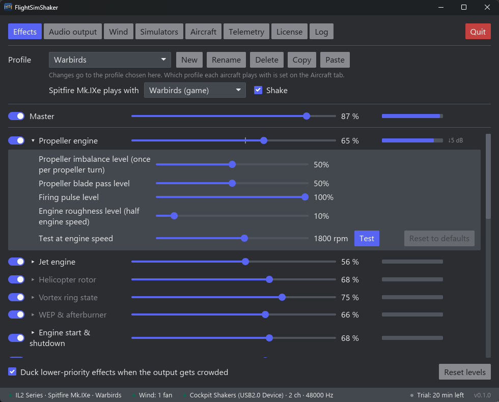
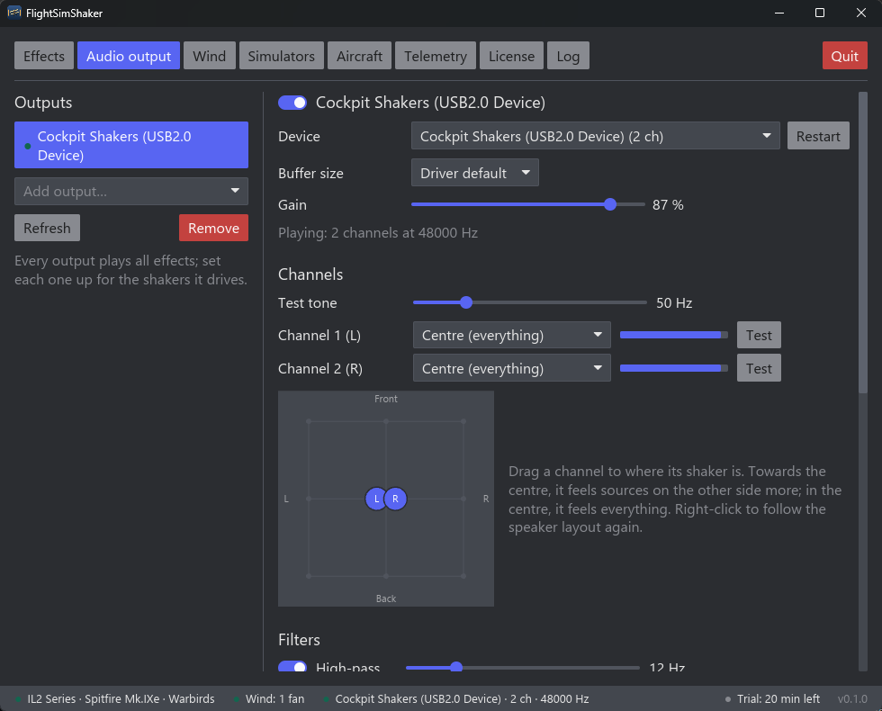
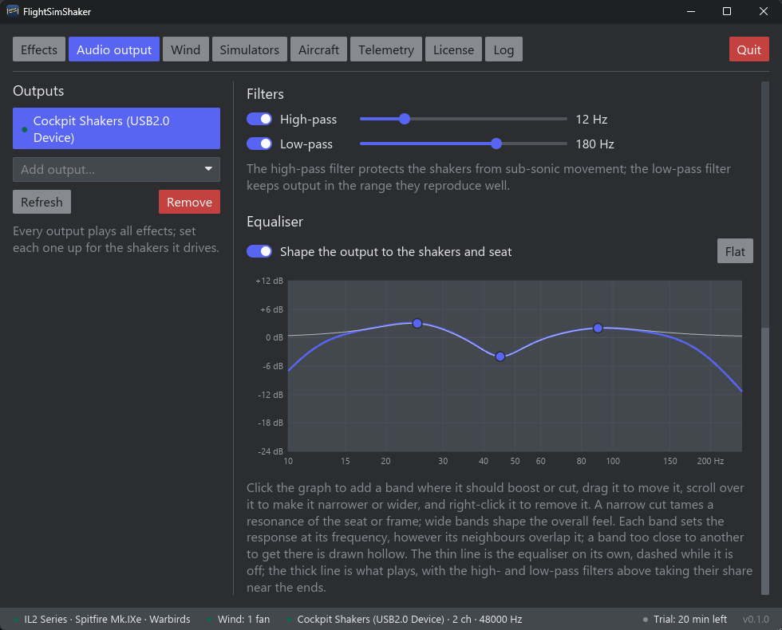
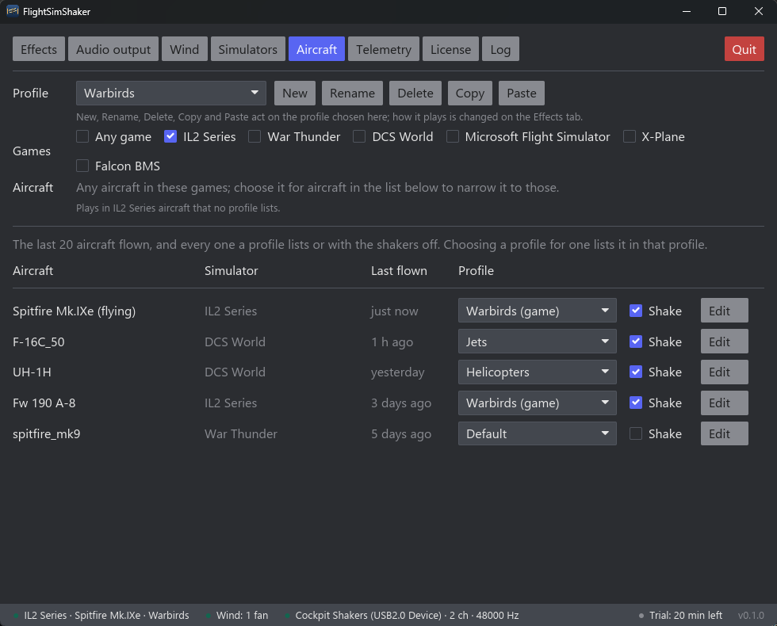
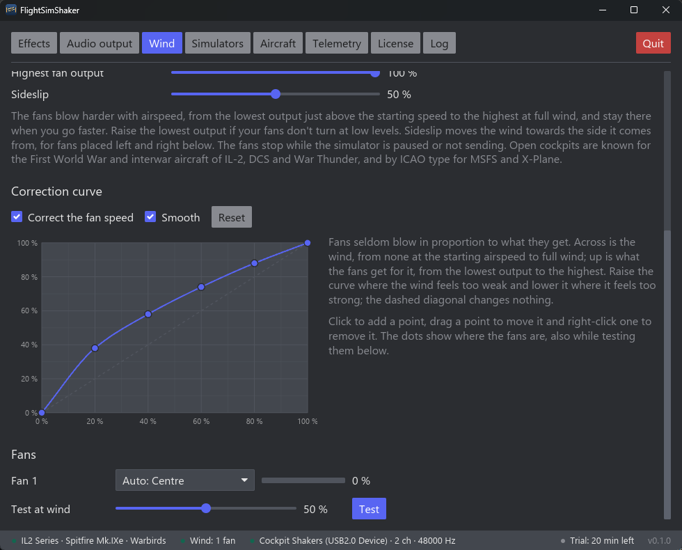
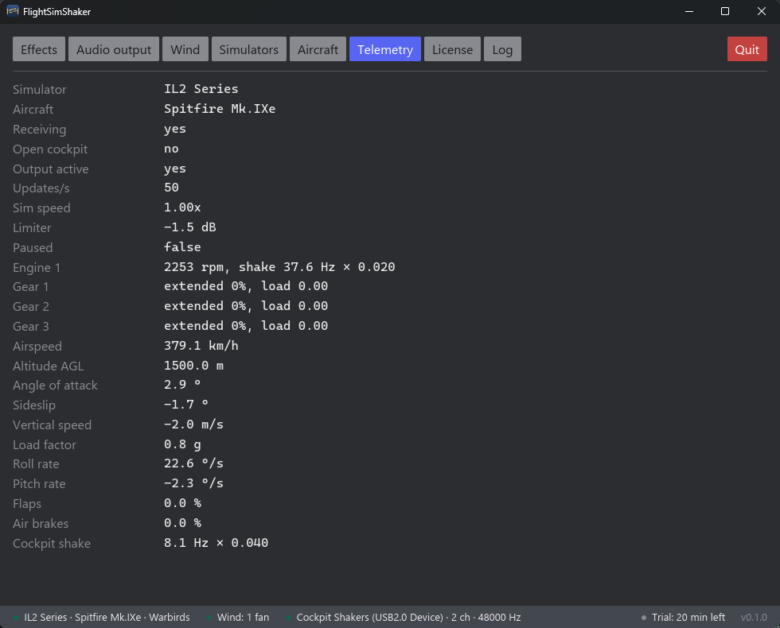
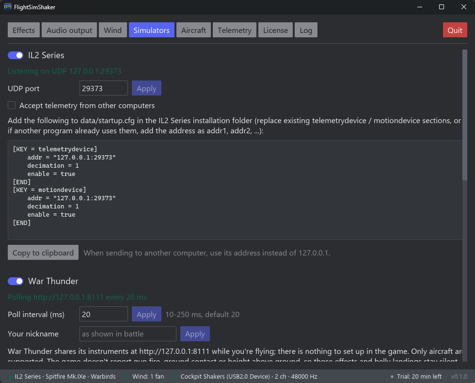

# FlightSimShaker

A bass shaker (tactile transducer) driver for flight simulators. It turns simulator telemetry into
low-frequency audio for ButtKicker / Dayton style shakers, and can drive wind fans too.



## Supported simulators

| Simulator | Status |
| --- | --- |
| IL-2 Sturmovik: Great Battles | Supported |
| IL-2 Sturmovik: Korea | Supported |
| War Thunder (aircraft) | Beta |
| DCS World | Beta |
| Microsoft Flight Simulator 2020 and 2024 | Beta |
| X-Plane 12 | Beta |
| Falcon BMS 4.33 and later | Beta |

IL-2 is the only simulator that has been properly tested so far. The others are marked **Beta**:
the app reads them and every effect they can drive plays, but they have had little or no time in
the game itself, so some effects may be too weak, too strong, on the wrong side or missing.
Feedback on how they feel is very welcome.

## Download

Get `FlightSimShaker-win-Setup.exe` from the
[latest release](https://github.com/dalen/FlightSimShaker/releases/latest) and run it. The app
installs for the current user and updates itself.

Without a license, FlightSimShaker plays for 20 minutes each time it starts.
[Buy a license](https://buy.polar.sh/polar_cl_eDKNGm1BVYKm2ovCDO2iccWN5m9Wz7j1SXziX4RLTIS) (one-time
purchase, includes updates) and enter the key from the email on the app's *License* tab. Your keys
and activations are in the [customer portal](https://polar.sh/flightsimshaker/portal).

The installer isn't code-signed yet, so Windows may show "Windows protected your PC". Click
**More info**, then **Run anyway**.

## Features

### Effects

26 effects, each with its own on/off switch, level and settings, and a *Test* button to
feel it without a simulator running:

* **Engines**: propeller engines play at their real frequencies (propeller imbalance, blade pass,
  cylinder firing), taken from a built-in database of aircraft engines. Jet engines, helicopter
  rotors, WEP and afterburner, engine start and shutdown, and reverse thrust have effects of
  their own.
* **Weapons and combat**: gun fire, hits received, explosions, impacts and crashes, and bomb,
  rocket, missile and countermeasure releases.
* **Ground handling**: touchdowns and bumps, the ground roll (rougher on grass and dirt than on a
  runway), wheel brakes, belly landings, and catapult launches, arrested landings and drag chutes.
* **Flight**: airflow over the airframe, turbulence, stall buffet and cockpit shake, drag from the
  air brakes, landing gear and flaps, vortex ring state in helicopters, and, off by default,
  G-force, sideslip and roll & pitch rate.

Effects that know where their source is (engines, guns, landing gear, hits, explosions) are felt
towards it, left or right and front or back, when you have more than one shaker. Short events
such as gun fire and hits get headroom first; continuous effects are turned down when the output
would clip. Output fades out when the simulator is paused or stops sending.

Which effects play depends on what each simulator reports. For example, War Thunder doesn't
report gun fire, so the gun fire effect stays silent there.

### Audio outputs

Use any number of sound cards, each with its own gain, channels, filters and equaliser, for
example one for the seat and one for the pedals. Drag each channel to where its shaker sits.
A test tone helps you find and level-match the shakers. If a sound card goes away (unplugged,
sleep, another program taking it), the app waits for it and picks it up again.



A parametric equaliser shapes the output to your shakers and seat: click the graph to add a band,
drag it to move it and scroll over it to make it narrower or wider. A narrow cut tames a resonance
of the seat or frame; wide bands shape the overall feel.



### Profiles per aircraft

Tune the effects differently for different aircraft or games, so a jet's afterburner and a
biplane's rattling engine can each be set up without undoing the other. The *Aircraft* tab lists
the aircraft you've flown and which profile each plays with, so you can sort them out after a
flight rather than in the middle of one. You can also turn the shakers off for one aircraft.
*Copy* and *Paste* share a profile as text, on a forum or in a chat.



### Wind fans

Fans on an Arduino running SimHub's firmware blow as hard as the aircraft flies, and move towards
the side the wind comes from when you slip. By default they only run in aircraft with an open
cockpit. A correction curve makes up for fans that don't blow in proportion to what they get.



### Telemetry

The *Telemetry* tab shows what the simulator is reporting, which helps when an effect doesn't
play as expected.



## Setup

The app's *Simulators* tab has a section for each simulator, with its status and what to set up.



### IL-2 Sturmovik

Add this to `data/startup.cfg` in the IL-2 installation directory. The app's *Simulators* tab
shows the same snippet and can copy it for you.

```
[KEY = telemetrydevice]
    addr = "127.0.0.1:29373"
    decimation = 1
    enable = true
[END]
[KEY = motiondevice]
    addr = "127.0.0.1:29373"
    decimation = 1
    enable = true
[END]
```

If another program already receives IL-2 telemetry, keep its `addr` and add ours as
`addr1 = "127.0.0.1:29373"` in both sections.

### War Thunder (Beta)

There's nothing to set up. While you're in a battle, War Thunder shares its instruments on this
PC, and the app reads them while you're flying. War Thunder reports less than the other
simulators: it doesn't report gun fire, hits, ground contact or height above ground, so the
weapon, impact, touchdown, rolling and belly landing effects stay silent. Stall buffet is worked
out from the angle of attack. Ground vehicles aren't supported.

If you enter your nickname on the *Simulators* tab (including any `#` and number after it), being
shot down is read from the kill feed and felt as a heavy hit. This only works with the game in
English.

### DCS World (Beta)

DCS only shares telemetry with export scripts, so the app installs one for you. Click
**Install** in the DCS section of the app's *Simulators* tab, then start a mission. Other export
scripts you use, such as SRS, Tacview or DCS-BIOS, keep working. **Remove** takes the script out
again.

DCS has no hit events, so hits are felt when a part of the aircraft fails, and not every aircraft
reports failures. It doesn't report afterburner use, so the WEP & afterburner effect stays silent.

### Microsoft Flight Simulator 2020 and 2024 (Beta)

There's nothing to set up. The app connects through SimConnect, which is on by default, whenever
the simulator is running. MSFS doesn't report gun fire, weapons or hits, so those effects stay
silent; crashing is felt as a heavy hit.

### X-Plane 12 (Beta)

In X-Plane, open *Settings > Network* and turn on *Accept incoming connections*. No plugin is
needed. Weapons and hits aren't read, so those effects stay silent; crashing is felt as a heavy
hit.

### Falcon BMS (Beta)

There's nothing to set up. The app reads BMS's shared memory whenever BMS is running on this PC,
including its gun, weapon, hit and ejection events. Wheel braking and the runway surface aren't
reported, and every aircraft is treated as a jet.

### Wind fans

Set the Arduino up with SimHub's Arduino setup tool (ShakeIt PWM fans, or fans on one of its motor
drivers) as usual, then choose its serial port on the app's *Wind* tab and turn the fans on. Only
one program can use the port, so close SimHub (or remove the Arduino from its Arduino settings)
while FlightSimShaker drives the fans. SimHub isn't needed once the firmware is on the board.
